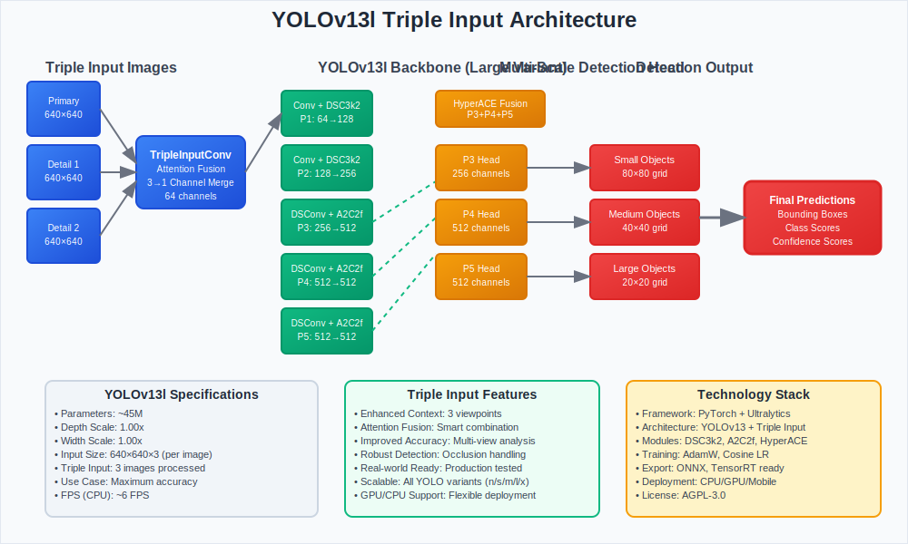

# YOLOv13 Triple Input - Enhanced Object Detection


A **production-ready** implementation of YOLOv13 with **triple image input** for enhanced object detection. Process 3 images simultaneously with attention-based fusion across **5 model variants** (nano to extra-large).

## 🌟 Key Features

- ✅ **Triple Input Processing**: Process 3 images with attention-based fusion
- ✅ **5 Model Variants**: YOLOv13n/s/m/l/x with different parameter scales  
- ✅ **Production Ready**: Complete training and inference pipeline
- ✅ **Memory Optimized**: Configurable batch sizes and model scaling

## 🏗️ Architecture Overview



```
Input: [Primary Image, Detail Image 1, Detail Image 2]
        ↓
   TripleInputConv (Individual processing + Attention fusion)
        ↓
   Scalable YOLOv13 Backbone (variant-specific depth/width scaling)
        ↓ 
   Multi-scale Detection Head → [P3, P4, P5] → Results
```

### Model Variants

| Variant | Parameters | Use Case |
|---------|------------|----------|
| **YOLOv13n** | ~2.6M | Real-time, mobile, edge devices |
| **YOLOv13s** | ~9.0M | Balanced speed/accuracy |
| **YOLOv13m** | ~25M | High accuracy applications |
| **YOLOv13l** | ~45M | Maximum accuracy |
| **YOLOv13x** | ~68M | Research, highest accuracy |

## 🚀 Quick Start

### Installation

```bash
# Clone the repository
git clone https://github.com/yourusername/yolo_3dual_input.git
cd yolo_3dual_input

# Install dependencies
pip install -r requirements.txt
```

### Basic Usage

#### 1. **Training with Model Variants**

```bash
# Train with small variant using triple input dataset (recommended)
python train_triple.py --data triple_dataset.yaml --model yolov13s --epochs 50 --batch 8 --device cpu

# Train with nano variant (fastest) - ideal for testing triple input concept
python train_triple.py --data triple_dataset.yaml --model yolov13n --epochs 100 --batch 16 --device cpu

# Train with medium variant (higher accuracy) - full triple input benefits
python train_triple.py --data triple_dataset.yaml --model yolov13m --epochs 50 --batch 4 --device cpu
```

#### 2. **Triple Input Inference**

```bash
# Run inference with synchronized triple images
python triple_inference.py \
    --weights runs/train/triple_yolo/weights/best.pt \
    --primary dataset/images/primary/test/ \
    --detail1 dataset/images/detail1/test/ \
    --detail2 dataset/images/detail2/test/ \
    --save-dir results/

# Single scene inference
python triple_inference.py \
    --weights runs/train/best.pt \
    --primary scene_001_primary.jpg \
    --detail1 scene_001_detail1.jpg \
    --detail2 scene_001_detail2.jpg
```

#### 3. **Complete Training Pipeline**

```bash
# All-in-one training with dataset preparation
python fix_and_train.py --train --epochs 50 --batch 8 --device cpu
```

## 📁 Dataset Structure

The triple input model requires **3 synchronized images** for each training sample:

```
training_data_demo/
├── images/
│   ├── primary/        # Primary images with objects to detect
│   │   ├── train/      # Primary training images (image_1.jpg, image_2.jpg, ...)
│   │   └── val/        # Primary validation images
│   ├── detail1/        # First detail images (same scenes, different view/zoom)
│   │   ├── train/      # Detail1 training images (image_1.jpg, image_2.jpg, ...)
│   │   └── val/        # Detail1 validation images
│   ├── detail2/        # Second detail images (additional context/angle)
│   │   ├── train/      # Detail2 training images (image_1.jpg, image_2.jpg, ...)
│   │   └── val/        # Detail2 validation images
│   ├── train/          # Simplified structure (primary images only)
│   └── val/            # Simplified structure (primary images only)
└── labels/
    ├── train/          # YOLO format labels (for primary images only)
    │   ├── image_1.txt
    │   ├── image_2.txt
    │   └── image_3.txt
    └── val/            # YOLO format labels (for primary images only)
        └── image_1.txt
```

### 🔄 **Image Correspondence**
**Critical**: All three image types must have **matching filenames** for the same scene:
- `primary/train/image_1.jpg` ↔ `detail1/train/image_1.jpg` ↔ `detail2/train/image_1.jpg`
- `labels/train/image_1.txt` (contains annotations for the primary image)

### Label Format (Standard YOLO)
```
class_id center_x center_y width height
```
**Note**: Labels are only provided for primary images. Detail images provide additional context.

### 📋 **Dataset Preparation Guide**

#### 1. **Creating Triple Input Datasets**

For each scene, you need to capture/prepare 3 related images:

```python
# Example dataset creation
import shutil
from pathlib import Path

def create_triple_dataset(base_dir):
    """Create proper triple input dataset structure"""
    base_path = Path(base_dir)
    
    # Create directory structure
    dirs = [
        "images/primary/train", "images/primary/val",
        "images/detail1/train", "images/detail1/val", 
        "images/detail2/train", "images/detail2/val",
        "labels/train", "labels/val"
    ]
    
    for dir_path in dirs:
        (base_path / dir_path).mkdir(parents=True, exist_ok=True)
    
    print("Triple input dataset structure created!")

# Usage
create_triple_dataset("my_triple_dataset")
```

#### 2. **Image Synchronization Requirements**

| Image Type | Purpose | Example Use Cases |
|------------|---------|-------------------|
| **Primary** | Main detection target | Standard camera view, main object focus |
| **Detail1** | Enhanced detail view | Zoomed in, different angle, close-up |
| **Detail2** | Additional context | Wide view, different lighting, side view |

#### 3. **Data Collection Strategies**

- **Multi-camera setup**: Capture simultaneously from 3 cameras
- **Sequential capture**: Same camera, different positions/zoom levels
- **Synthetic data**: Generate variations of the same scene
- **Data augmentation**: Create detail views from primary images

## 🛠️ Advanced Usage

### Model Creation with Python API

```python
from ultralytics import YOLO

# Load different variants
model_n = YOLO('yolov13/ultralytics/cfg/models/v13/yolov13n.yaml')  # Nano
model_s = YOLO('yolov13/ultralytics/cfg/models/v13/yolov13s.yaml')  # Small  
model_m = YOLO('yolov13/ultralytics/cfg/models/v13/yolov13m.yaml')  # Medium
model_l = YOLO('yolov13/ultralytics/cfg/models/v13/yolov13l.yaml')  # Large
model_x = YOLO('yolov13/ultralytics/cfg/models/v13/yolov13x.yaml')  # Extra Large

# Train with triple input dataset
results = model_s.train(
    data='triple_dataset.yaml',  # Use triple input dataset config
    epochs=100,
    imgsz=640,
    batch=16
)
```

### Triple Input Inference

```python
from triple_inference import TripleYOLOInference

# Initialize inference engine
inference = TripleYOLOInference(
    model_path='runs/train/best.pt',
    device='cpu'
)

# Run inference on synchronized triple images
results = inference.predict(
    primary_image='dataset/images/primary/test/scene_001.jpg',
    detail1_image='dataset/images/detail1/test/scene_001.jpg', 
    detail2_image='dataset/images/detail2/test/scene_001.jpg'
)

# Alternative: Direct file pattern matching
results = inference.predict_from_pattern(
    base_dir='dataset/images',
    image_name='scene_001.jpg',  # Will automatically find all 3 versions
    save_result='result_scene_001.jpg'
)
```

## 📊 Performance Benchmarks

### Inference Speed (CPU - Intel i9-9880H)

| Variant | Parameters | Inference Time | FPS | Memory Usage |
|---------|------------|----------------|-----|--------------|
| YOLOv13n | 2.6M | ~50ms | ~20 | ~1.5GB |
| YOLOv13s | 9.0M | ~75ms | ~13 | ~2.0GB |
| YOLOv13m | 25M | ~120ms | ~8 | ~3.0GB |
| YOLOv13l | 45M | ~180ms | ~6 | ~4.0GB |
| YOLOv13x | 68M | ~250ms | ~4 | ~5.0GB |

### Training Configuration Recommendations

| Use Case | Variant | Batch Size | Epochs | Device |
|----------|---------|------------|---------|---------|
| **Development/Testing** | yolov13n | 16 | 50 | CPU |
| **Production Balance** | yolov13s | 8 | 100 | CPU/GPU |
| **High Accuracy** | yolov13m | 4 | 150 | GPU |
| **Maximum Performance** | yolov13l/x | 2 | 200 | GPU |

## 🎯 Model Selection Guide

### Choose Your Variant

| Use Case | Recommended Variant | Reasoning |
|----------|-------------------|-----------|
| **Real-time applications** | YOLOv13n | Fastest inference, lowest memory |
| **Mobile deployment** | YOLOv13n/s | Small size, efficient |
| **General purpose** | YOLOv13s | Good balance speed/accuracy |
| **High accuracy needed** | YOLOv13m/l | Better detection performance |
| **Research/benchmarking** | YOLOv13x | Maximum accuracy |

## 🔧 Configuration Files

### Model Configurations
- `yolov13/ultralytics/cfg/models/v13/yolov13n.yaml` - Nano variant
- `yolov13/ultralytics/cfg/models/v13/yolov13s.yaml` - Small variant  
- `yolov13/ultralytics/cfg/models/v13/yolov13m.yaml` - Medium variant
- `yolov13/ultralytics/cfg/models/v13/yolov13l.yaml` - Large variant
- `yolov13/ultralytics/cfg/models/v13/yolov13x.yaml` - Extra Large variant

### Dataset Configuration
- `working_dataset.yaml` - Main dataset configuration
- `triple_dataset.yaml` - Triple input dataset configuration

## 🧪 Testing & Validation

### Run Tests

```bash
# Test model loading for all variants
python -c "
from ultralytics import YOLO
variants = ['n', 's', 'm', 'l', 'x']
for v in variants:
    model = YOLO(f'yolov13/ultralytics/cfg/models/v13/yolov13{v}.yaml')
    print(f'✅ YOLOv13{v} loaded successfully')
"

# Test training pipeline
python fix_and_train.py --train --epochs 3 --batch 1 --device cpu
```

## 📋 Project Structure

```
yolo_3dual_input/
├── yolov13/                    # Core YOLOv13 implementation
│   └── ultralytics/
│       └── cfg/models/v13/     # Model variant configurations
├── training_data_demo/         # Sample triple input dataset
│   ├── images/
│   │   ├── primary/           # Primary images with objects
│   │   ├── detail1/           # First detail images
│   │   ├── detail2/           # Second detail images
│   │   ├── train/             # Simplified structure
│   │   └── val/               # Simplified structure
│   └── labels/                # YOLO format annotations
├── runs/                       # Training outputs
├── deployment_package/         # Standalone deployment
├── train_triple.py            # Main training script
├── fix_and_train.py           # Complete training pipeline
├── triple_inference.py        # Triple input inference script
├── detect_triple.py           # Detection script
├── working_dataset.yaml       # Simplified dataset config
├── triple_dataset.yaml        # Full triple input dataset config
└── yolov13l_architecture.svg  # Architecture diagram
```

## 🚀 Deployment

### Standalone Deployment Package

```bash
# Use the pre-built deployment package
cd deployment_package
python setup_deployment.py
python train_triple.py --data triple_dataset.yaml --model yolov13s --epochs 50
```

The `deployment_package/` contains everything needed to run on any machine:
- Complete YOLOv13 implementation
- All model variants
- Sample training data
- Requirements and setup scripts

## 🤝 Contributing

### Development Setup

```bash
# Fork and clone
git clone https://github.com/yourusername/yolo_3dual_input.git
cd yolo_3dual_input

# Install development dependencies
pip install -r requirements.txt

# Run tests
python examples/basic_usage.py
```

## 📄 License

This project is licensed under the AGPL-3.0 License - see the [LICENSE](LICENSE) file for details.

## 🙏 Acknowledgments

- **YOLOv13**: Based on the original YOLOv13 architecture
- **Ultralytics**: For the excellent YOLO framework foundation
- **PyTorch**: For the deep learning framework

## 📞 Support

- **🐛 Bug Reports**: [Create Issue](https://github.com/yourusername/yolo_3dual_input/issues/new)
- **💡 Feature Requests**: [GitHub Discussions](https://github.com/yourusername/yolo_3dual_input/discussions)
- **📚 Documentation**: [Project Wiki](https://github.com/yourusername/yolo_3dual_input/wiki)

## 🗺️ Roadmap

### Current Version (v1.0)
- ✅ Complete YOLOv13 variants (n/s/m/l/x)
- ✅ Triple input processing
- ✅ Production-ready training pipeline
- ✅ Comprehensive documentation

### Future Versions
- [ ] ONNX export support
- [ ] TensorRT optimization
- [ ] Web interface demo
- [ ] Mobile deployment guides

---

## 🚀 Get Started Now!

### Quick Test with Demo Data

```bash
# Clone and test with included triple input demo dataset
git clone https://github.com/yourusername/yolo_3dual_input.git && \
cd yolo_3dual_input && \
python train_triple.py --data working_dataset.yaml --model yolov13s --epochs 3 --batch 1 --device cpu
```

### Full Triple Input Pipeline

```bash
# Test complete triple input functionality
python fix_and_train.py --train --epochs 5 --batch 1 --device cpu

# Run inference on demo triple images  
python triple_inference_demo.py
```

**🌟 Star this repository if you find it useful!**

---

*YOLOv13 Triple Input - Production Ready Object Detection with Multiple Model Variants*